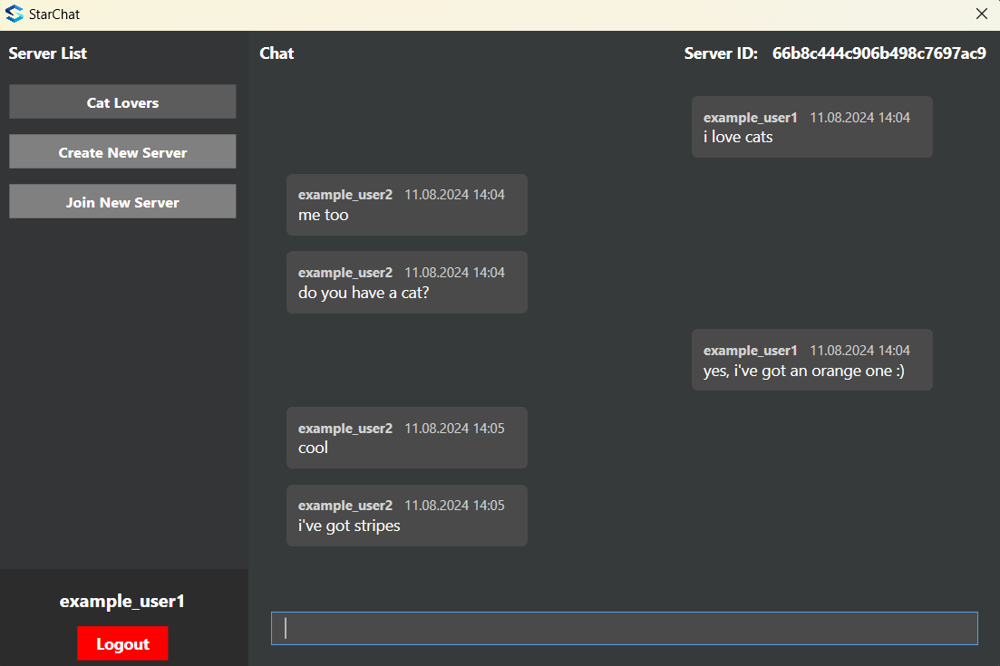

# StarChat
Discord-like real-time chat communicator.

The backend was developed using C# with the .NET 6.0 framework, and the desktop application was built with C# using WPF. MongoDB is used as the database. This project was created to learn about WebSockets, non-relational databases, and native desktop applications.

## What can be done additionaly in this project
- add redis,
- add kafka,
- deploy it on the cloud.

The program allows multiple users to connect to multiple servers. It first loads historical messages and then connects to the server’s WebSocket to receive new messages in real-time, rather than through API calls.

When a user sends a message, the app transmits the content to the server via the WebSocket, where a new message object is created. Once the message is saved into the database, it is broadcast to every WebSocket connected to that server.

## Screenshots

### Chat messages between two users
<table>
<tr>
    <td></td>
    <td></td>
</tr>
</table>

### Login Screen

### Register Screen

### Main Screen

### Creating new server

### After creating new server

### Joining new server

